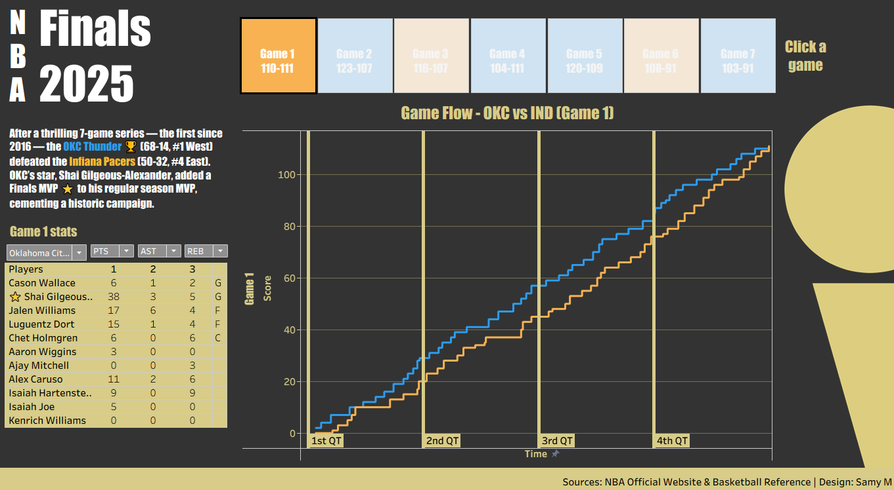

# Data Scientist & Analyst

## Showcase

<table>
    <tr>
        <td style="text-align:center; vertical-align:middle; width:35%;">
            <h3>The Big 3 - Ratings Anime Breakdown</h3>
            

                Description.
                  
                <a href="" target="_blank">View full viz</a>
            

            
                Pop Culture
            
        </td>
        <td width="65%">
            

                
                
                 
                <button class="prev slider-btn">◀</button>
                <button class="next slider-btn">▶</button>
            

        </td>
    </tr>
    <tr>
        <td style="text-align:center; vertical-align:middle; width:35%;">
            <h3>UFC Expansion & Potential - Dashboard</h3>
            

                Description.
                  
                <a href="" target="_blank">View full viz</a>
            

            
                Pop Culture
            
        </td>
        <td width="65%">
            

                
            

        </td>
    </tr>
    <tr>
        <td style="text-align:center; vertical-align:middle; width:35%;">
            <h3>The Diamond's Path - Tribute to Dustin Poirier</h3>
            

                Description.
                  
                <a href="" target="_blank">View full viz</a>
            

            
                Pop Culture
            
        </td>
        <td width="65%">
            

                
                
                 
                <button class="prev slider-btn">◀</button>
                <button class="next slider-btn">▶</button>
            

        </td>
    </tr>
    <tr>
        <td style="text-align:center; vertical-align:middle; width:35%;">
            <h3>2025 NBA Finals - Game Flow Dashboard</h3>
            

                Description.
                  
                <a href="" target="_blank">View full viz</a>
            

            
                Pop Culture
            
        </td>
        <td width="65%">
            

                
            

        </td>
    </tr>
</table>

