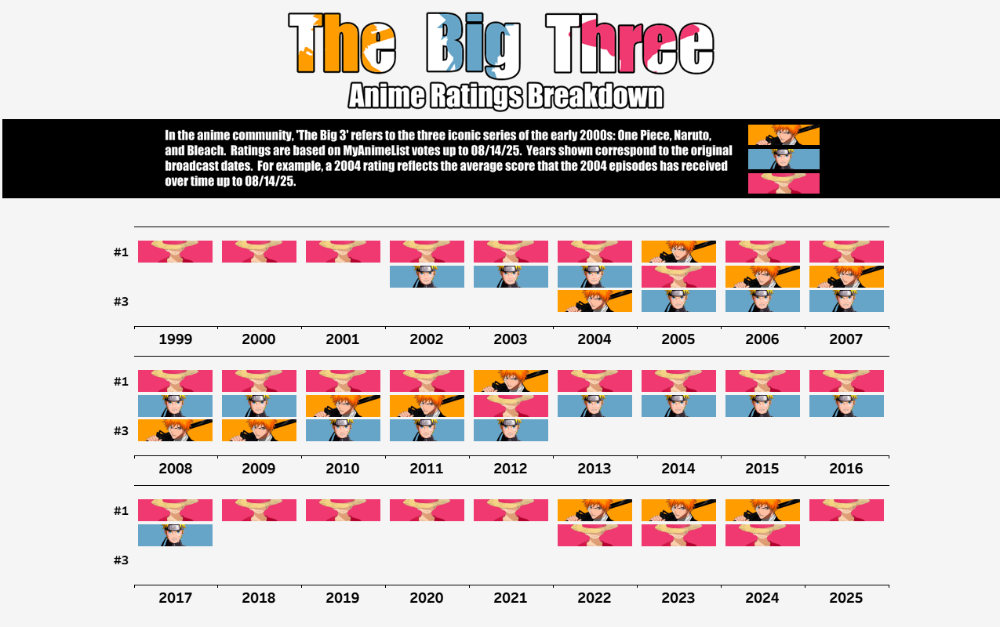
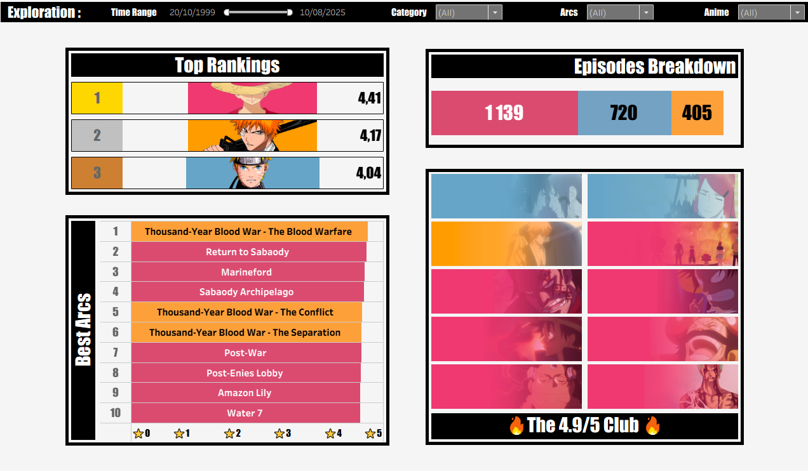
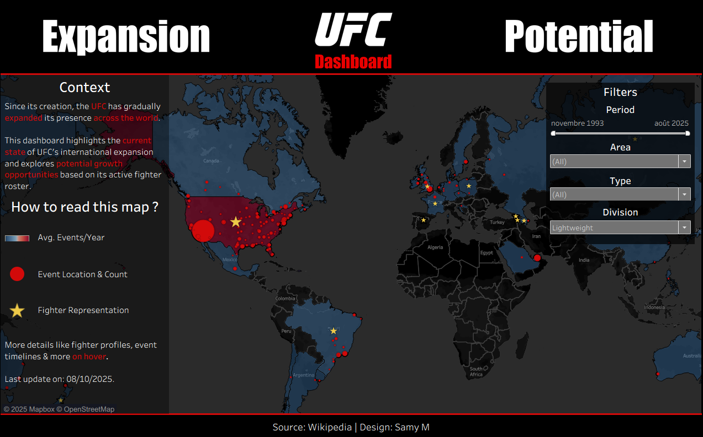
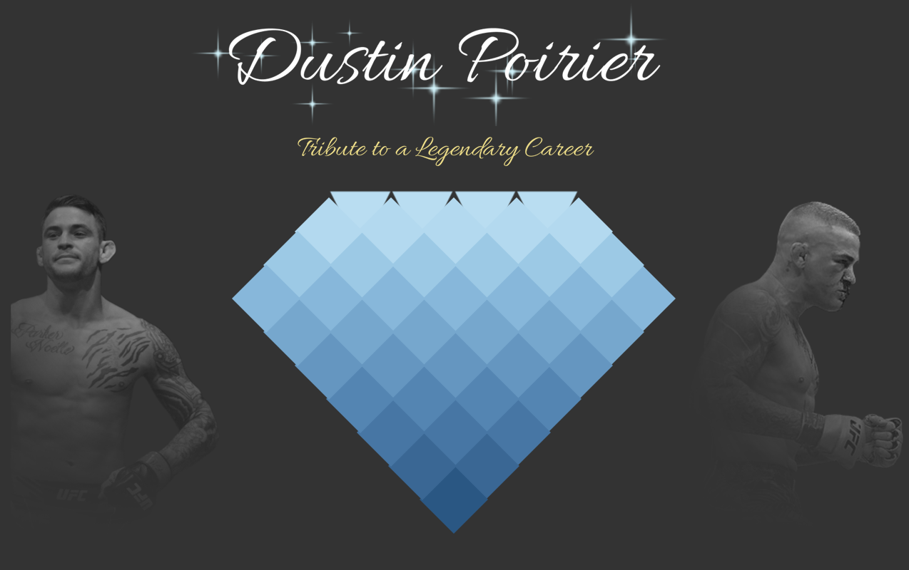
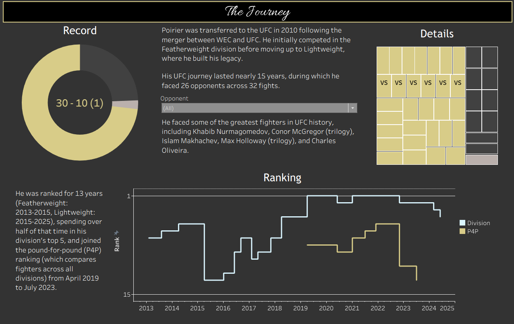
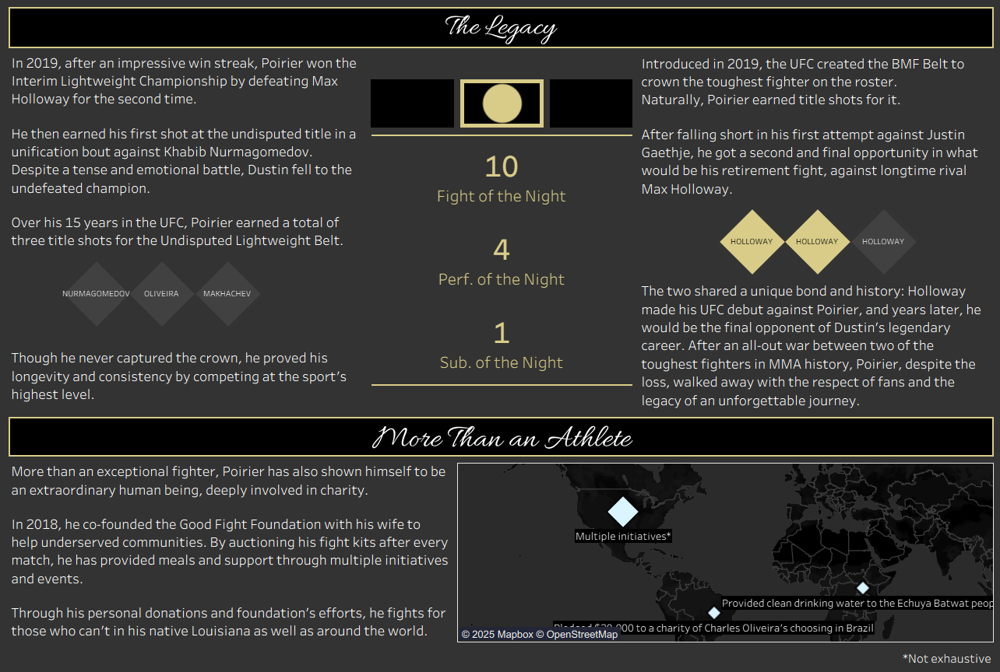

# Samy M.

## About me

---

Text about me...

## Showcase

---

<table>
    <tr>
        <td style="vertical-align:middle;">
            

                
                    Pop Culture
                
            

             
            <h3 style="text-align:center;">The Big 3 - Ratings Anime Breakdown</h3>
            

                
                
                 
                <button class="prev slider-btn">◀</button>
                <button class="next slider-btn">▶</button>
            

            

                In the anime community, "The Big 3" refers to the three iconic series of the 2000s: One Piece, Naruto and Bleach.
                 
                The dashboard explores MyAnimeList episode ratings across time, comparing yearly averages, arcs, fillers, top-rated episodes and more...
                 
            

            

                <a href="https://public.tableau.com/app/profile/samy.m6642/viz/TheBig3-AnimeRatingsBreakdown/TheBig3" target="_blank">View full viz</a>
            

        </td>
    </tr>
    <tr>
        <td style="vertical-align:middle;">
            

                
                    Sports
                
            

            <h3 style="text-align:center;">UFC Expansion & Potential - Dashboard</h3>
            

                
            

            

                Since its creation in 1993, the UFC has gradually expanded its presence across the world, going from 5 countries involved in 2002 to 29 by 2025.
                 
                This dashboard highlights the current state of UFC's international expansion and explores potential growth opportunities based on its active fighter roster.
            

            

                <a href="https://public.tableau.com/app/profile/samy.m6642/viz/UFCExpansionPotential-Dashboard/UFCExpansionPotential" target="_blank">View full viz</a>
            

        </td>
    </tr>
    <tr>
        <td style="text-align:center; vertical-align:middle;">
            <h3>The Diamond's Path - Tribute to Dustin Poirier</h3>
            

                Follow Dustin Poirier’s journey through the MMA world: key fights, milestones, and his impact both inside and outside the octagon.
                  
                <a href="https://public.tableau.com/app/profile/samy.m6642/viz/TheDiamondsPath-TributetoDustinPoirier/TheDiamondsPath" target="_blank">View full viz</a>
            

            
                Sports
            
            

                
                
                
                 
                <button class="prev slider-btn">◀</button>
                <button class="next slider-btn">▶</button>
            

        </td>
    </tr>
</table>

## Contact

---

Contact links...

